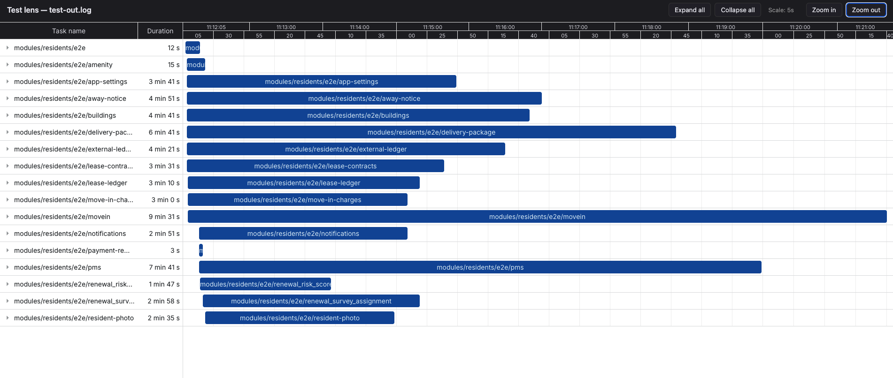
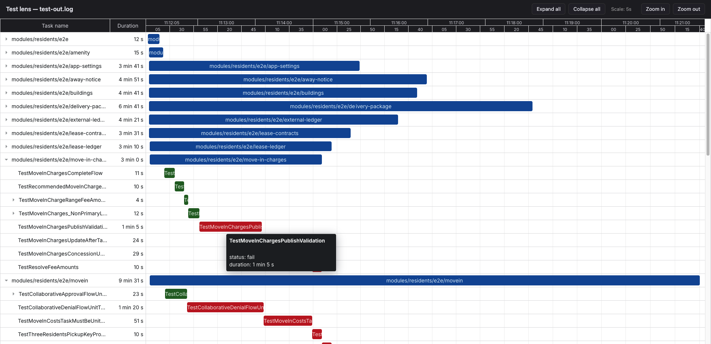

# testlens

CLI that reads a Go **test2json** log (one JSON object per line; see `go help testflag` / `cmd/test2json`) and writes a self-contained **HTML** file with an interactive **DHTMLX Gantt** timeline.

## Screenshots

Package rows on the timeline (collapsed tree, duration column, second-level time scale):



Expanded tree with pass (green) / fail (red) tests, tooltips, and zoom controls:



## Run

```bash
go run . -in test2json.log [-o output.html]
```

Default output path: `testlens-report.html`. The input file is always passed with **`-in`**, which matches idiomatic use of Go’s [`flag`](https://pkg.go.dev/flag) package (no positional arguments). Use `go run . -help` for full usage.

Input must be JSON lines compatible with `encoding/json` unmarshaling into `TestEvent` in `model.go` (`Time`, `Action`, `Package`, `Test`, `Elapsed`, `Output`).

## Layout

| File                     | Responsibility                                                                                       |
| ------------------------ | ---------------------------------------------------------------------------------------------------- |
| `main.go`                | Argument parsing, orchestration                                                                      |
| `parser.go`              | Read log; large line buffer for huge `output` lines                                                  |
| `model.go`               | `TestEvent`, `GanttTask`, `GanttData`                                                                |
| `converter.go`           | Package → test → subtest tree; strips module prefix `github.com/venn-city/venn-platform` for display |
| `renderer.go`            | Embeds `templates/gantt.gohtml`, writes HTML                                                         |
| `templates/gantt.gohtml` | DHTMLX Gantt (CDN), readonly chart, status colors                                                    |

## Behavior notes

- Rows are driven by **`pass` / `fail` / `skip`** events with a `Test` name; **`run`** supplies start times when present.
- **Package** rows appear only for packages that have at least one finished test in the log.
- **test2json** does not include `_test.go` file paths; grouping is package + test function + subtest (after `/`).

## Changing the report

- **Data shape / hierarchy**: edit `converter.go`.
- **Styling / Gantt config**: edit `templates/gantt.gohtml` (DHTMLX `gantt.config`, CSS, templates).
- Prefer **stdlib only**; avoid new module dependencies unless there is a strong reason.
